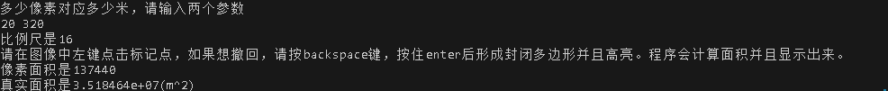
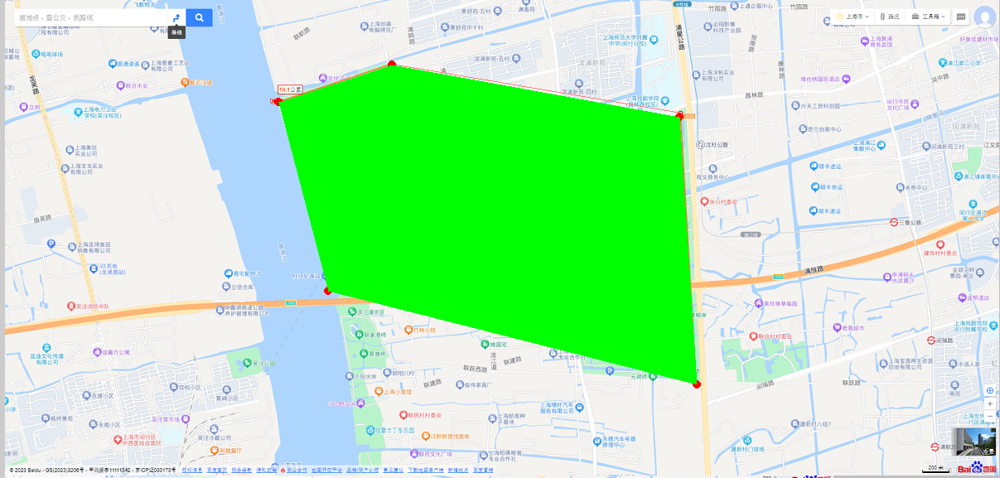
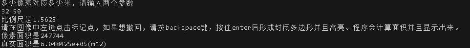
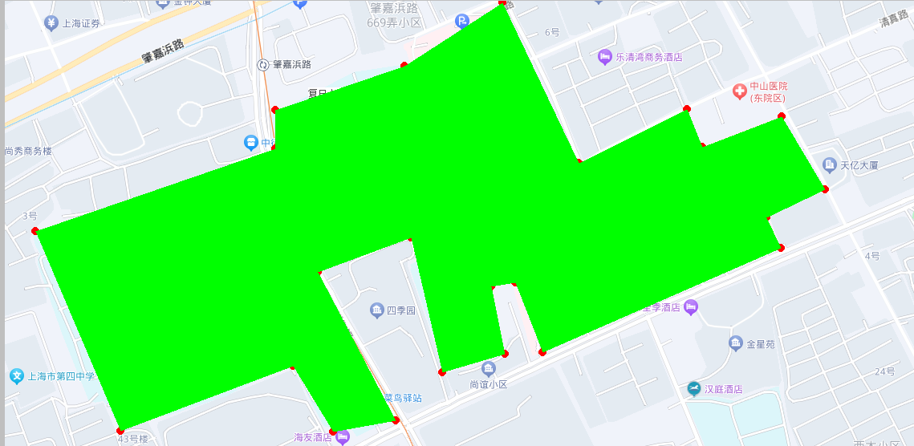

# 编译说明

- 需要把caculate_area.cpp中的路径改成自己的路径
- 默认PNG格式，需要JPEG需要一定更改。
- 编译命令如下
```bash
g++ caculate_area.cpp -o main -lfltk -lfltk_images
```

- 也可以直接运行./main，是example2的运行结果


# example1

图片路径: ./pdemo.png

### 终端交互如下

<!-- 插入图片 -->


### GUI界面如下



# example2

图片路径: ./fudan.png

### 终端交互如下

<!-- 插入图片 -->


### GUI界面如下




